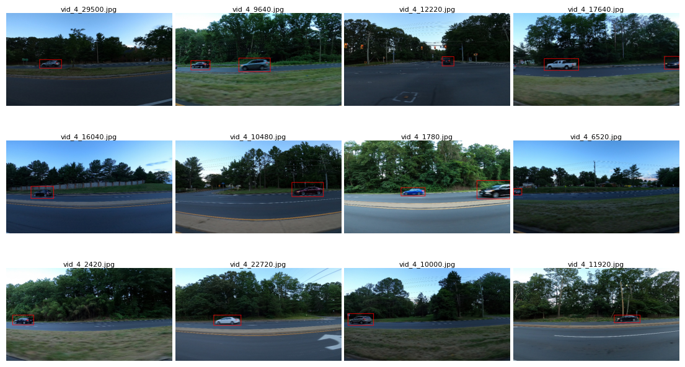
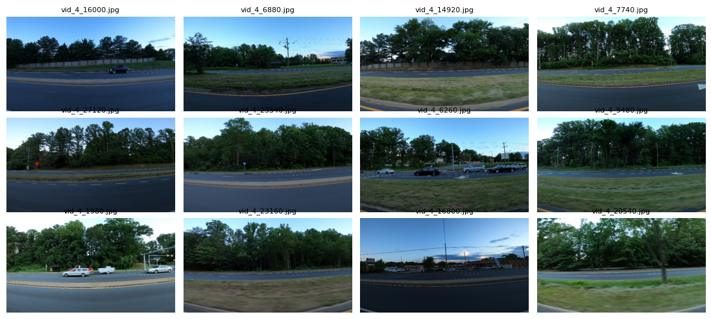
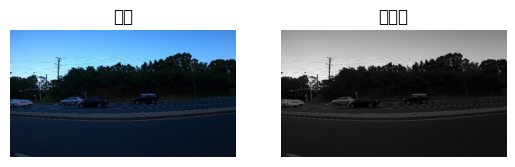
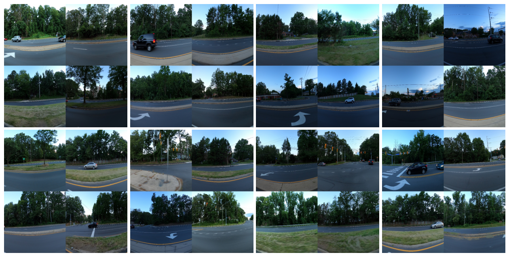
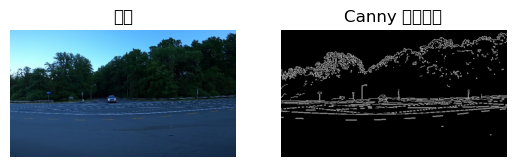
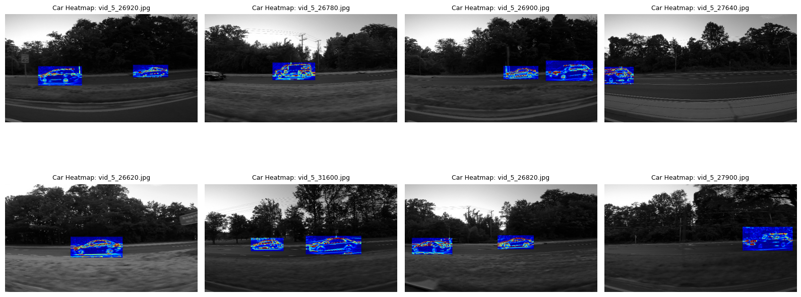

```python
import os
import pandas as pd

# 数据路径
data_dir = r"D:\Personal\Documents\GitHub\YoloV8_MAH\data"

# 文件夹
train_img_dir = os.path.join(data_dir, "training_images")
test_img_dir = os.path.join(data_dir, "testing_images")

# CSV 文件
csv_bounds = os.path.join(data_dir, "train_solution_bounding_boxes (1).csv")
csv_sample = os.path.join(data_dir, "sample_submission.csv")

# 查看训练图片数量
print("训练图片数量:", len(os.listdir(train_img_dir)))
print("测试图片数量:", len(os.listdir(test_img_dir)))

# 读取标注 CSV
df = pd.read_csv(csv_bounds, sep="\t|,", engine="python")  # 有些文件可能是tab分隔
print("标注文件前几行：")
print(df.head())

# 读取提交示例
sample_df = pd.read_csv(csv_sample)
print("提交文件示例：")
print(sample_df.head())

```

    训练图片数量: 1001
    测试图片数量: 175
    标注文件前几行：
                 image        xmin        ymin        xmax        ymax
    0   vid_4_1000.jpg  281.259045  187.035071  327.727931  223.225547
    1  vid_4_10000.jpg   15.163531  187.035071  120.329957  236.430180
    2  vid_4_10040.jpg  239.192475  176.764801  361.968162  236.430180
    3  vid_4_10020.jpg  496.483358  172.363256  630.020260  231.539575
    4  vid_4_10060.jpg   16.630970  186.546010  132.558611  238.386422
    提交文件示例：
                 image                           bounds
    0  vid_5_26560.jpg  0.0 0.0 1.0 1.0 0.0 0.0 1.0 1.0
    1  vid_5_26580.jpg  0.0 0.0 1.0 1.0 0.0 0.0 1.0 1.0
    2  vid_5_26600.jpg                  0.0 0.0 1.0 1.0
    3  vid_5_26620.jpg                  0.0 0.0 1.0 1.0
    4  vid_5_26640.jpg                  0.0 0.0 1.0 1.0
    


```python
import os
import pandas as pd
from PIL import Image
import numpy as np

# -------------------
# 1. 路径设置
# -------------------
data_dir = r"D:\Personal\Documents\GitHub\YoloV8_MAH\data"
train_img_dir = os.path.join(data_dir, "training_images")
csv_bounds = os.path.join(data_dir, "train_solution_bounding_boxes (1).csv")

# 输出 YOLO 标签文件夹
labels_dir = os.path.join(data_dir, "labels")
os.makedirs(labels_dir, exist_ok=True)

# -------------------
# 2. 读取 CSV
# -------------------
df = pd.read_csv(csv_bounds)

print("标注文件前几行:")
print(df.head())

# -------------------
# 3. 转换为 YOLO 格式
# -------------------
class_id = 0  # 只有汽车一个类别，所以类别 = 0

missing_files = []  # 记录丢失的图片
converted_count = 0

for idx, row in df.iterrows():
    image_name = row['image'].strip()  # 去掉可能的空格
    xmin, ymin, xmax, ymax = row[['xmin', 'ymin', 'xmax', 'ymax']].values

    # 图片路径
    img_path = os.path.join(train_img_dir, image_name)

    if not os.path.exists(img_path):
        missing_files.append(image_name)
        continue

    # --- 用 PIL 来读取 ---
    try:
        img = Image.open(img_path).convert("RGB")
        img = np.array(img)
        h, w, _ = img.shape
    except Exception as e:
        print(f"⚠️ PIL 读取失败: {img_path}, 错误: {e}")
        continue

    # 转 YOLO 格式 (归一化到 0~1)
    x_center = ((xmin + xmax) / 2) / w
    y_center = ((ymin + ymax) / 2) / h
    bbox_width = (xmax - xmin) / w
    bbox_height = (ymax - ymin) / h

    # 生成标签文件路径
    label_path = os.path.join(labels_dir, image_name.replace(".jpg", ".txt"))

    # 写入 YOLO 格式 (一张图可能有多个框，所以用 append)
    with open(label_path, "a") as f:
        f.write(f"{class_id} {x_center:.6f} {y_center:.6f} {bbox_width:.6f} {bbox_height:.6f}\n")

    converted_count += 1

# -------------------
# 4. 结果输出
# -------------------
print(f"\n✅ 成功转换 {converted_count} 个标注框到 YOLO 格式，保存在: {labels_dir}")

if missing_files:
    print("\n❌ 以下图片在 training_images 文件夹中未找到:")
    print(missing_files[:20])  # 只显示前20个，避免太长
    print(f"总共缺失 {len(missing_files)} 张图片")
else:
    print("\n🎉 没有缺失图片，所有标注已成功转换！")

```

    标注文件前几行:
                 image        xmin        ymin        xmax        ymax
    0   vid_4_1000.jpg  281.259045  187.035071  327.727931  223.225547
    1  vid_4_10000.jpg   15.163531  187.035071  120.329957  236.430180
    2  vid_4_10040.jpg  239.192475  176.764801  361.968162  236.430180
    3  vid_4_10020.jpg  496.483358  172.363256  630.020260  231.539575
    4  vid_4_10060.jpg   16.630970  186.546010  132.558611  238.386422
    
    ✅ 成功转换 559 个标注框到 YOLO 格式，保存在: D:\Personal\Documents\GitHub\YoloV8_MAH\data\labels
    
    🎉 没有缺失图片，所有标注已成功转换！
    


```python
import os
import random
import pandas as pd
from PIL import Image, ImageDraw
import matplotlib.pyplot as plt

# 路径
data_dir = r"D:\Personal\Documents\GitHub\YoloV8_MAH\data"
train_img_dir = os.path.join(data_dir, "training_images")
csv_bounds = os.path.join(data_dir, "train_solution_bounding_boxes (1).csv")

# 读取标注
df = pd.read_csv(csv_bounds)

# 随机挑选 12 张图片
sample_images = random.sample(df['image'].unique().tolist(), 12)

# 子图布局 (3行x4列)
fig, axes = plt.subplots(3, 4, figsize=(14, 8))

for ax, img_name in zip(axes.ravel(), sample_images):
    img_path = os.path.join(train_img_dir, img_name)
    img = Image.open(img_path).convert("RGB")
    draw = ImageDraw.Draw(img)

    # 找出该图片对应的所有标注框
    boxes = df[df['image'] == img_name][['xmin','ymin','xmax','ymax']].values
    for (xmin, ymin, xmax, ymax) in boxes:
        draw.rectangle([xmin, ymin, xmax, ymax], outline="red", width=2)

    ax.imshow(img)
    ax.set_title(img_name, fontsize=8, pad=2)  # 🔹 标题紧贴图片
    ax.axis("off")

# 🔹 调整行间距为极小
plt.subplots_adjust(wspace=0.02, hspace=0.01)  
plt.show()

```


    

    


```python
from ultralytics import YOLO

# 加载预训练的 YOLOv8s 模型
model = YOLO("yolov8s.pt")

```


```python
import matplotlib.pyplot as plt
import matplotlib.image as mpimg
import os, random

# 数据路径（比如训练集）
img_dir = r"D:\Personal\Documents\GitHub\YoloV8_MAH\data\images\train"

# 随机选 12 张
all_images = [f for f in os.listdir(img_dir) if f.endswith(".jpg")]
sample_images = random.sample(all_images, 12)

# 创建画布，注意高度调小让行间距紧凑
fig, axes = plt.subplots(3, 4, figsize=(14, 6))

for ax, img_file in zip(axes.flatten(), sample_images):
    img = mpimg.imread(os.path.join(img_dir, img_file))
    ax.imshow(img)
    ax.set_title(img_file, fontsize=8)
    ax.axis("off")

# 调整间距（水平间距 wspace，垂直间距 hspace）
plt.subplots_adjust(wspace=0.05, hspace=0.05)

# 保存为 600dpi 高分辨率图片
save_path = r"D:\Personal\Documents\GitHub\YoloV8_MAH\data\dataset_preview.png"
plt.savefig(save_path, dpi=600, bbox_inches="tight")

plt.show()
print(f"✅ 已保存 600dpi 图片到: {save_path}")

```


    

    


    ✅ 已保存 600dpi 图片到: D:\Personal\Documents\GitHub\YoloV8_MAH\data\dataset_preview.png
    


```python
import cv2
import matplotlib.pyplot as plt
import os, random

img_dir = r"D:\Personal\Documents\GitHub\YoloV8_MAH\data\images\train"
img_file = random.choice([f for f in os.listdir(img_dir) if f.endswith(".jpg")])
img_path = os.path.join(img_dir, img_file)

# 读取原图和彩色转灰度
img = cv2.imread(img_path)
img_rgb = cv2.cvtColor(img, cv2.COLOR_BGR2RGB)
img_gray = cv2.cvtColor(img, cv2.COLOR_BGR2GRAY)

plt.subplot(1,2,1); plt.imshow(img_rgb); plt.title("原图"); plt.axis("off")
plt.subplot(1,2,2); plt.imshow(img_gray, cmap="gray"); plt.title("灰度图"); plt.axis("off")
plt.show()

```

    D:\Python\Anaconda\Lib\site-packages\IPython\core\pylabtools.py:170: UserWarning: Glyph 21407 (\N{CJK UNIFIED IDEOGRAPH-539F}) missing from font(s) DejaVu Sans.
      fig.canvas.print_figure(bytes_io, **kw)
    D:\Python\Anaconda\Lib\site-packages\IPython\core\pylabtools.py:170: UserWarning: Glyph 22270 (\N{CJK UNIFIED IDEOGRAPH-56FE}) missing from font(s) DejaVu Sans.
      fig.canvas.print_figure(bytes_io, **kw)
    D:\Python\Anaconda\Lib\site-packages\IPython\core\pylabtools.py:170: UserWarning: Glyph 28784 (\N{CJK UNIFIED IDEOGRAPH-7070}) missing from font(s) DejaVu Sans.
      fig.canvas.print_figure(bytes_io, **kw)
    D:\Python\Anaconda\Lib\site-packages\IPython\core\pylabtools.py:170: UserWarning: Glyph 24230 (\N{CJK UNIFIED IDEOGRAPH-5EA6}) missing from font(s) DejaVu Sans.
      fig.canvas.print_figure(bytes_io, **kw)
    


    

    


```python
import cv2
import matplotlib.pyplot as plt
import os, random
import numpy as np

# 数据路径（训练集）
img_dir = r"D:\Personal\Documents\GitHub\YoloV8_MAH\data\images\train"
all_images = [f for f in os.listdir(img_dir) if f.endswith(".jpg")]

def make_mosaic(img_list, size=320):
    """从四张图生成一张 Mosaic"""
    imgs = [cv2.cvtColor(cv2.imread(os.path.join(img_dir, f)), cv2.COLOR_BGR2RGB) for f in img_list]
    imgs_resized = [cv2.resize(img, (size, size)) for img in imgs]
    top = np.hstack((imgs_resized[0], imgs_resized[1]))
    bottom = np.hstack((imgs_resized[2], imgs_resized[3]))
    return np.vstack((top, bottom))

# 生成 8 张 Mosaic
mosaic_images = []
for _ in range(8):
    sample_imgs = random.sample(all_images, 4)
    mosaic_images.append(make_mosaic(sample_imgs))

# 展示 2行4列
fig, axes = plt.subplots(2, 4, figsize=(16, 8))
for ax, mosaic in zip(axes.flatten(), mosaic_images):
    ax.imshow(mosaic)
    ax.axis("off")
plt.subplots_adjust(wspace=0.02, hspace=0.02)
plt.show()

```


    

    


```python
import cv2
import matplotlib.pyplot as plt

# 随机选一张训练图
img_path = r"D:\Personal\Documents\GitHub\YoloV8_MAH\data\images\train\vid_4_1000.jpg"

# 读取原图
img = cv2.imread(img_path)
img_rgb = cv2.cvtColor(img, cv2.COLOR_BGR2RGB)

# Canny 边缘检测
edges = cv2.Canny(img, 100, 200)

# 可视化
plt.subplot(1,2,1); plt.imshow(img_rgb); plt.title("原图"); plt.axis("off")
plt.subplot(1,2,2); plt.imshow(edges, cmap="gray"); plt.title("Canny 边缘检测"); plt.axis("off")
plt.show()

```

    D:\Python\Anaconda\Lib\site-packages\IPython\core\pylabtools.py:170: UserWarning: Glyph 21407 (\N{CJK UNIFIED IDEOGRAPH-539F}) missing from font(s) DejaVu Sans.
      fig.canvas.print_figure(bytes_io, **kw)
    D:\Python\Anaconda\Lib\site-packages\IPython\core\pylabtools.py:170: UserWarning: Glyph 22270 (\N{CJK UNIFIED IDEOGRAPH-56FE}) missing from font(s) DejaVu Sans.
      fig.canvas.print_figure(bytes_io, **kw)
    D:\Python\Anaconda\Lib\site-packages\IPython\core\pylabtools.py:170: UserWarning: Glyph 36793 (\N{CJK UNIFIED IDEOGRAPH-8FB9}) missing from font(s) DejaVu Sans.
      fig.canvas.print_figure(bytes_io, **kw)
    D:\Python\Anaconda\Lib\site-packages\IPython\core\pylabtools.py:170: UserWarning: Glyph 32536 (\N{CJK UNIFIED IDEOGRAPH-7F18}) missing from font(s) DejaVu Sans.
      fig.canvas.print_figure(bytes_io, **kw)
    D:\Python\Anaconda\Lib\site-packages\IPython\core\pylabtools.py:170: UserWarning: Glyph 26816 (\N{CJK UNIFIED IDEOGRAPH-68C0}) missing from font(s) DejaVu Sans.
      fig.canvas.print_figure(bytes_io, **kw)
    D:\Python\Anaconda\Lib\site-packages\IPython\core\pylabtools.py:170: UserWarning: Glyph 27979 (\N{CJK UNIFIED IDEOGRAPH-6D4B}) missing from font(s) DejaVu Sans.
      fig.canvas.print_figure(bytes_io, **kw)
    


    

    


```python
import os, random
import cv2
import numpy as np
import matplotlib.pyplot as plt
from ultralytics import YOLO

# 加载模型
model = YOLO(r"D:\Personal\Documents\GitHub\YoloV8_MAH\runs\detect\car_exp15\weights\best.pt")

# 测试集路径
test_dir = r"D:\Personal\Documents\GitHub\YoloV8_MAH\data\testing_images"
all_images = [f for f in os.listdir(test_dir) if f.endswith(".jpg")]

def get_heatmap_roi(img_rgb, box):
    """提取汽车区域并生成热力图"""
    x1, y1, x2, y2 = map(int, box)
    car_roi = img_rgb[y1:y2, x1:x2]
    if car_roi.size == 0:  # 空区域跳过
        return None, 0
    gray_roi = cv2.cvtColor(car_roi, cv2.COLOR_RGB2GRAY)
    grad_x = cv2.Sobel(gray_roi, cv2.CV_64F, 1, 0, ksize=3)
    grad_y = cv2.Sobel(gray_roi, cv2.CV_64F, 0, 1, ksize=3)
    grad_mag = cv2.magnitude(grad_x, grad_y)
    strength = np.mean(grad_mag)  # 平均强度
    heatmap = cv2.applyColorMap(cv2.convertScaleAbs(grad_mag), cv2.COLORMAP_JET)
    heatmap = cv2.cvtColor(heatmap, cv2.COLOR_BGR2RGB)
    return heatmap, strength

# 挑选 8 张有效图
selected_images = []
for img_file in random.sample(all_images, len(all_images)):
    img_path = os.path.join(test_dir, img_file)
    img = cv2.imread(img_path)
    img_rgb = cv2.cvtColor(img, cv2.COLOR_BGR2RGB)

    results = model.predict(source=img_rgb, conf=0.25, verbose=False)
    if len(results[0].boxes) == 0:
        continue  # 没有检测到车

    valid = False
    gray = cv2.cvtColor(img, cv2.COLOR_BGR2GRAY)
    gray_3ch = cv2.cvtColor(gray, cv2.COLOR_GRAY2RGB)
    output = gray_3ch.copy()

    for box in results[0].boxes.xyxy.cpu().numpy():
        # 筛选掉过小目标
        if (box[2] - box[0]) * (box[3] - box[1]) < 5000:
            continue
        heatmap, strength = get_heatmap_roi(img_rgb, box)
        if heatmap is not None and strength > 20:  # 热力强度阈值
            x1, y1, x2, y2 = map(int, box)
            output[y1:y2, x1:x2] = heatmap
            valid = True

    if valid:
        selected_images.append((img_file, output))
    if len(selected_images) == 8:
        break

# 绘制 2x4 网格
fig, axes = plt.subplots(2, 4, figsize=(16, 8))
for ax, (img_file, output) in zip(axes.flatten(), selected_images):
    ax.imshow(output)
    ax.set_title(f"Car Heatmap: {img_file}", fontsize=9)
    ax.axis("off")

plt.tight_layout()
save_path = r"D:\Personal\Documents\GitHub\YoloV8_MAH\data\car_heatmap_grid_strong.png"
plt.savefig(save_path, dpi=600, bbox_inches="tight")
plt.show()

print(f"✅ Saved filtered 600dpi heatmap grid at: {save_path}")

```


    

    


    ✅ Saved filtered 600dpi heatmap grid at: D:\Personal\Documents\GitHub\YoloV8_MAH\data\car_heatmap_grid_strong.png
    


```python

```
